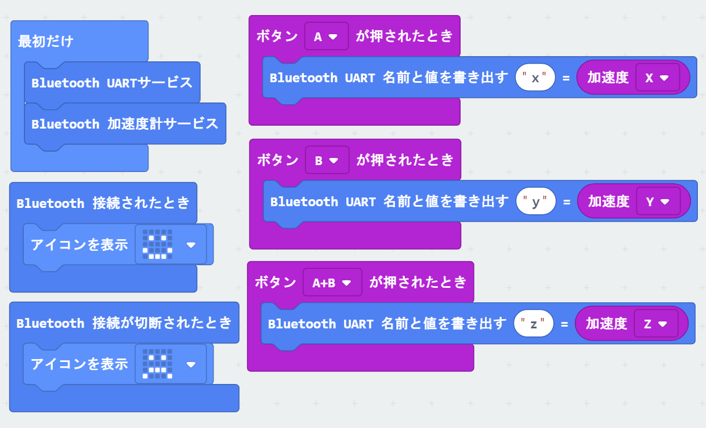

# micro:bitでWeb Bluetoothを使う

## micro:bit側のコード



[プログラムへのリンク](https://makecode.microbit.org/_fK2C7Eh23Kmp)

設定メニューの「プロジェクトの設定」を選択し、`No Pairing Required: Anyone can connect via Bluetooth.`を有効にしてプログラムを作成してください。

## Webブラウザ側のコード

```html
<!DOCTYPE html>
<html>
<head>
<meta charset="utf-8" />
<meta http-equiv="X-UA-Compatible" content="IE=edge"/>
<title></title>
</head>

<body>
<form name="js">
<input type="button" value="接続" onclick="connect();"/>
<input type="button" value="切断" onclick="disconnect();" />
<input type="text" name="data" value="" />
</form>

<script>

var uart_device;
var uart_characteristic;

//micro:bit BLE UUID UART
var NUS_SERVICE_UUID           = "6e400001-b5a3-f393-e0a9-e50e24dcca9e";
var NUS_TX_CHARACTERISTIC_UUID = "6e400003-b5a3-f393-e0a9-e50e24dcca9e";
var NUS_RX_CHARACTERISTIC_UUID = "6e400002-b5a3-f393-e0a9-e50e24dcca9e";

var Logger = {
  log: function(line) {
    document.querySelector('#log').textContent += line + '\n';
  },
  clearLog: function() {
    document.querySelector('#log').textContent = '';
  },
};
var log = Logger.log;

function connect() {
  navigator.bluetooth.requestDevice({
    filters: [{
      namePrefix: 'BBC micro:bit',
    }],
    optionalServices: [NUS_SERVICE_UUID]
  })
  .then(device => {
    uart_device = device;
    console.log("device", device);
    return device.gatt.connect();
  })
  .then(server =>{
    console.log("server", server)
    return server.getPrimaryService(NUS_SERVICE_UUID);
  })
  .then(service => {
    console.log("service", service)
    return service.getCharacteristic(NUS_RX_CHARACTERISTIC_UUID);
  })
  .then(chara => {
    console.log("UART:", chara)
    alert("BLE接続が完了しました。");
    characteristic = chara;
    characteristic.startNotifications();
    characteristic.addEventListener('characteristicvaluechanged',onReceiveUART);
  })
  .catch(error => {
    alert("BLE接続に失敗しました。もう一度試してみてください");
    console.log(error);
  });
}

function onReceiveUART(event) {
  var str_arr = [];
  for (var i = 0; i < event.target.value.byteLength; i++) {
    str_arr[i] = event.target.value.getUint8(i);
  }
  var str = String.fromCharCode.apply(null, str_arr);
  console.log('data:' + str);
  document.js.data.value = str;
}

function disconnect() {
  if (!uart_device || !uart_device.gatt.connected) return ;
  uart_device.gatt.disconnect();
  alert("BLE接続を切断しました。")
}

</script>
</body>
</html>
```
